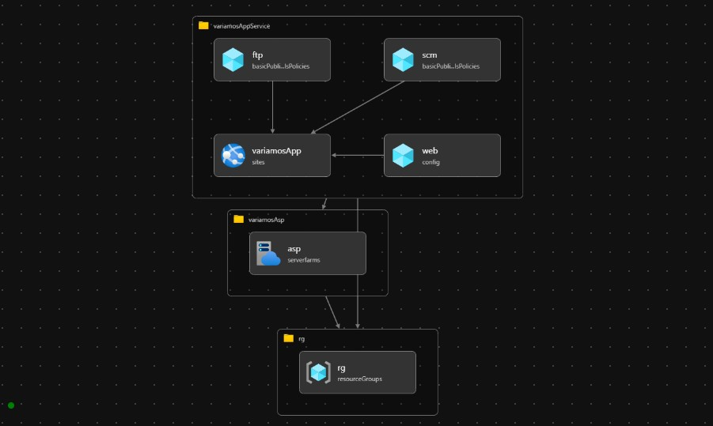

# variamosAsp.bicep

## Prerequisites

- Azure Subscription
- New Resource Group

## Deploy variamos to Azure

To deploy variamosApp execute from PowerShell the Next command:

    .\variamos.ps1 -deploymentName 'VariamosDeploy' -location 'westus' -templateFile 'variamos.bicep' -variamosAppName 'variamosapp' -appKind 'app,linux,container' -aspName 'variamosasp' -subscriptionName 'BizSpark-Applipets' -resourceGroupName 'rglabvariamos5000' -aspKind 'linux' -variamosApiName 'variamosapi' -variamosAppLanguajeName 'variamoslanguaje' -variamosAppRestrictionsName 'variamosrestrictions'

## [Decompile ARM into BICEP format](https://docs.microsoft.com/en-us/azure/azure-resource-manager/bicep/decompile?tabs=azure-cli)

    az bicep decompile --file variamos02.json