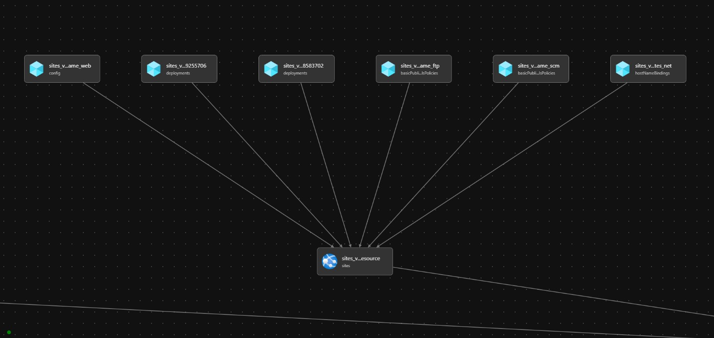
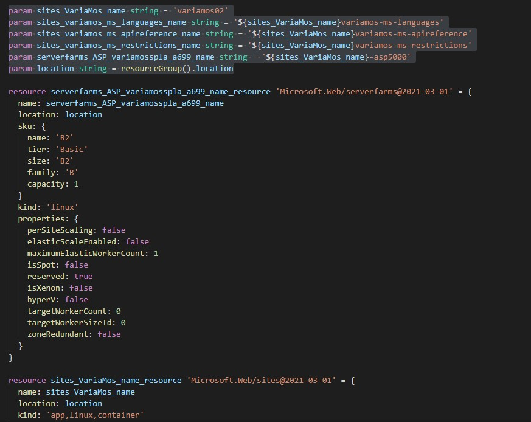
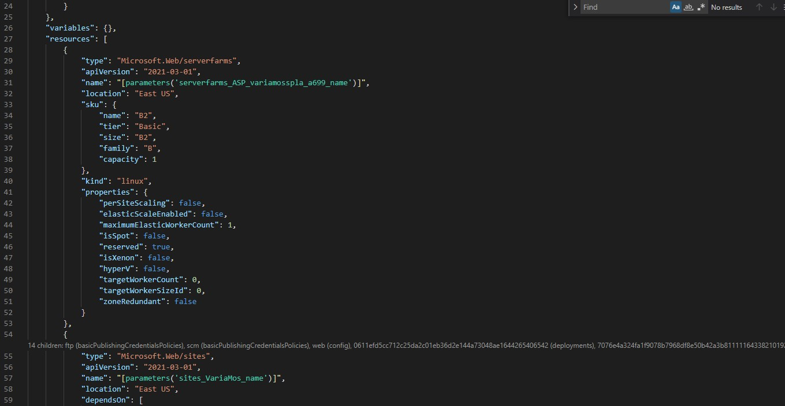

# Create a .bicep template from Variamos

In this Lab we are going to export the ARM Template, exporting it from Resoruces selection in the Azure Panel. Then the ARM template will be converted as .bicep temptlate. At last we are goin to create a new deployment Azure Resoruse Group Deployment, based on the new .bicep template.

- Export as ARM Template the selected Azure resoruces in located in the resoruce group: variamosspla from the Azure Subscription.
- [Decompile ARM into BICEP format](https://docs.microsoft.com/en-us/azure/azure-resource-manager/bicep/decompile?tabs=azure-cli)
    az bicep decompile --file variamos02.json
- Create a new Resorce Group
- Create a New-AzResourceGroupDeployment 
    .\template03.ps1

# Bicep Template Visualization

