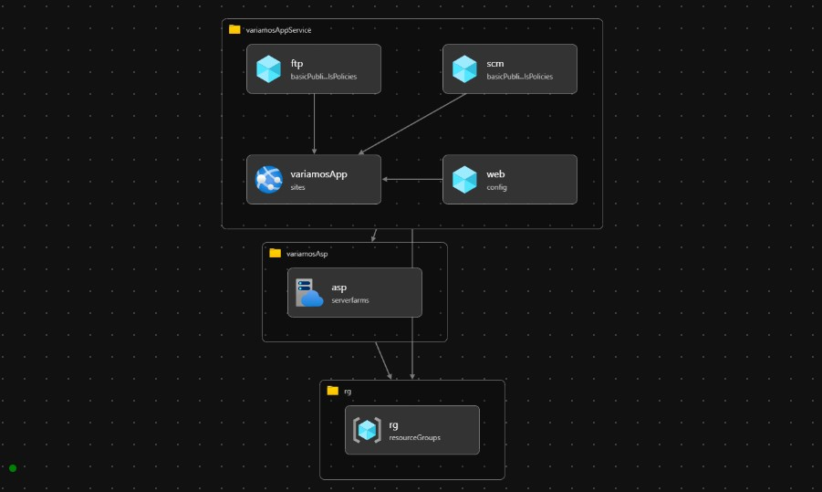

# variamosAsp.bicep

## Prerequisites

- Azure Subscription
- New Resource Group

## Deploy variamos to Azure 

To deploy variamosApp execute from PowerShell the Next command:

    .\variamosAppDeployment.ps1 -deploymentName 'VariamosAppDeploy' -templateFile 'variamosApp.bicep' -appName 'variamosapp' -ppKind 'app,linux,container' -aspName 'variamosasp' -subscriptionName '**********' -resourceGroupName 'rglabvariamos3000'

