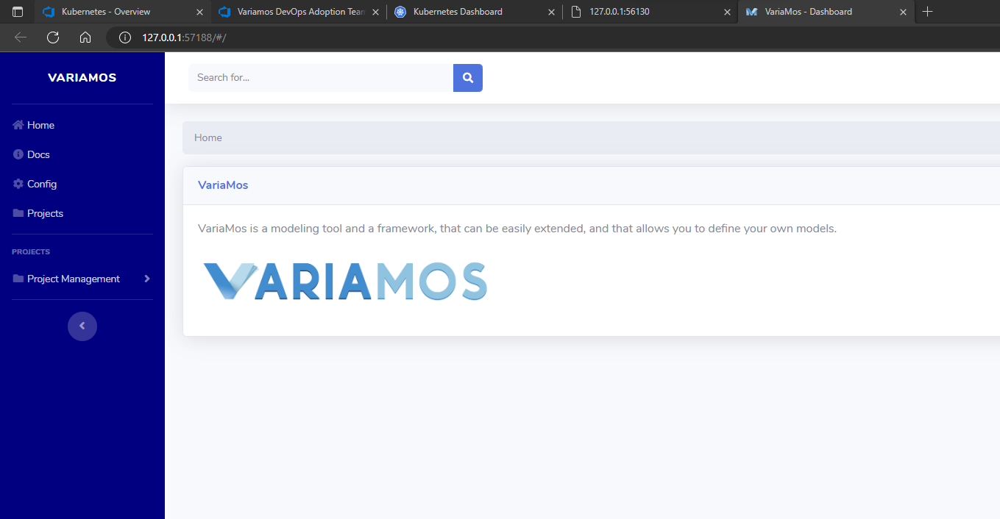

# Create a service from Variamos Old version in a minikube cluster from the latest Docker Image

## Prerequisites

- minikube installed on local machine

## Steeps

1. Create the deployment variamosold from yml file deinition

`kubectl create -f variamosold.yml`

1. Expose 

`kubectl expose deployment variamosold --type=NodePort`

1. browse the site

`minikube service variamosold`

## References

1. [Kubernetes on Jsoto Wiki](https://dev.azure.com/jsoto25/MaestriaSPLE/_wiki/wikis/Maestria%20-%20SPLE.wiki/253/Kubernetes)
2. [Learning Kubernetes (2018) - Linkedid Learning](https://www.linkedin.com/learning/learning-kubernetes/getting-up-and-running-mac-install-2?autoplay=true&contextUrn=urn%3Ali%3AlyndaLearningPath%3A5a724ea6498e02ebfd8de952)