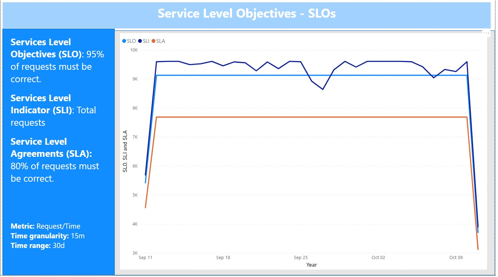

# Kusto Query to verify the SLO and SLA from VariaMos web App

**SLI**: Total Requests 
**SLO**: 90%
**SLA**: 80% 

## Kusto Query

requests
 | where timestamp > ago(30d)
 | extend success = tostring(customDimensions["status"])
 | summarize succeed = count(resultCode == "200"), total = count() by bin(timestamp, 1d)
 | extend SLI = succeed * 100.00/total
 | extend SLO = 90
 | extend SLA = 80 
 | project SLI, SLO, SLA , timestamp
 | render timechart 

 **Results in Azure Insigths**

 

 ## Power Query Formula Language (M Language )

 let AnalyticsQuery =
let Source = Json.Document(Web.Contents("https://api.applicationinsights.io/v1/apps/ce07b6e1-24f7-4a1f-8e8f-d515bbe711ef/query", 
[Query=[#"query"="requests | where timestamp > ago(30d) | extend success = tostring(customDimensions[""status""]) | summarize succeed = count(resultCode == ""200""), total = count() by bin(timestamp, 15m) | extend SLI = succeed * 100.00/total | extend SLO = 90 | extend SLA = 80 | project SLI, SLO, SLA , timestamp | render timechart
",#"x-ms-app"="AAPBI",#"prefer"="ai.response-thinning=true"],Timeout=#duration(0,0,4,0)])),
TypeMap = #table(
{ "AnalyticsTypes", "Type" }, 
{ 
{ "string",   Text.Type },
{ "int",      Int32.Type },
{ "long",     Int64.Type },
{ "real",     Double.Type },
{ "timespan", Duration.Type },
{ "datetime", DateTimeZone.Type },
{ "bool",     Logical.Type },
{ "guid",     Text.Type },
{ "dynamic",  Text.Type }
}),
DataTable = Source[tables]{0},
Columns = Table.FromRecords(DataTable[columns]),
ColumnsWithType = Table.Join(Columns, {"type"}, TypeMap , {"AnalyticsTypes"}),
Rows = Table.FromRows(DataTable[rows], Columns[name]), 
Table = Table.TransformColumnTypes(Rows, Table.ToList(ColumnsWithType, (c) => { c{0}, c{3}}))
in
Table
in AnalyticsQuery

**Results in Power BI**

 

