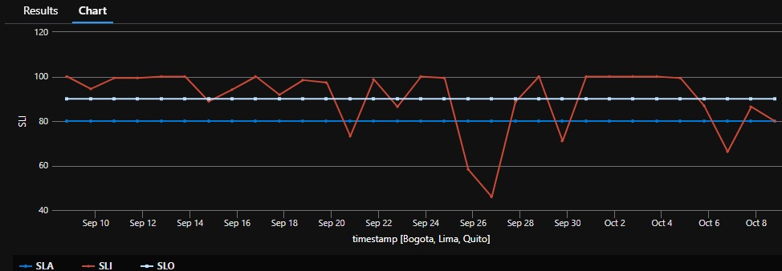

# Kusto Query to verify the SLO and SLA from VariaMos web App

**SLI**: Total Requests 
**SLO**: 90%
**SLA**: 80% 

requests
 | where timestamp > ago(30d)
 | extend success = tostring(customDimensions["status"])
 | summarize succeed = count(resultCode == "200"), total = count() by bin(timestamp, 1d)
 | extend SLI = succeed * 100.00/total
 | extend SLO = 90
 | extend SLA = 80 
 | project SLI, SLO, SLA , timestamp
 | render timechart 

 **Result**

 