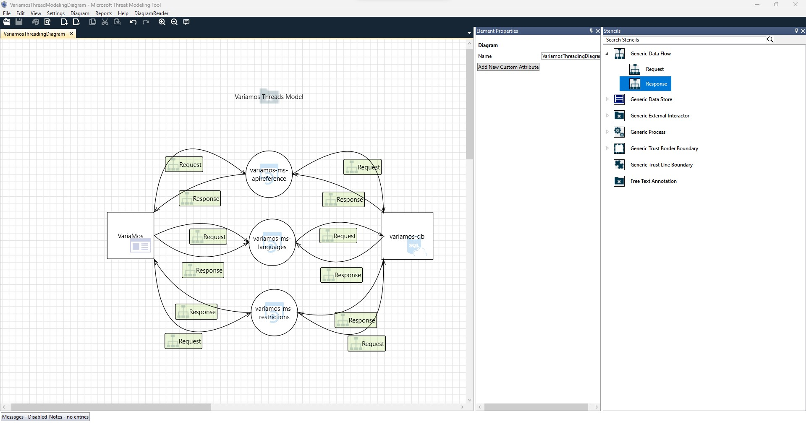
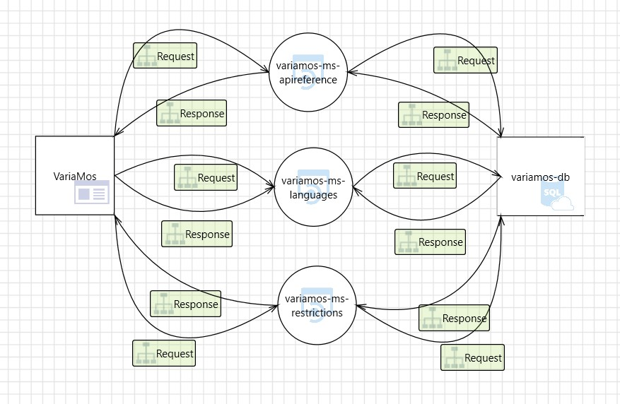

# Variamos Thread Model

The following are the VariaMos App thread model. It models was created with the DSL tool, Microsoft Thread Modeling Tool.

## References

- [Automation to Enable SRE with GitHub Actions/Azure DevOps/Azure Automation](https://learning-oreilly-com.ezproxy.eafit.edu.co/library/view/the-art-of/9781484287040/html/521227_1_En_5_Chapter.xhtml)

- [Getting started with the Threat Modeling Tool](https://learn.microsoft.com/en-us/azure/security/develop/threat-modeling-tool-getting-started)