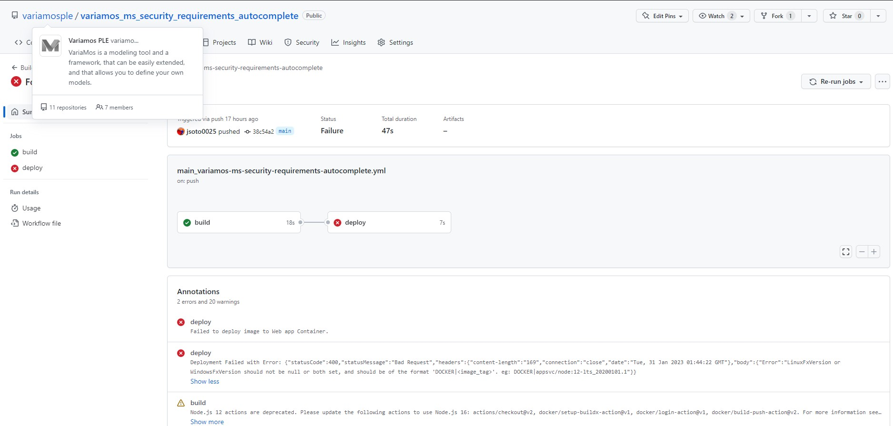

# LinuxFxVersion or WindowsFxVersion should not be null or both set

## Error datails

**Description** 
Deployment Failed with Error: {"statusCode":400,"statusMessage":"Bad Request","headers":{"content-length":"169","connection":"close","date":"Tue, 31 Jan 2023 01:44:22 GMT"},"body":{"Error":"LinuxFxVersion or WindowsFxVersion should not be null or both set, and should be of the format 'DOCKER|<image_tag>'. eg: DOCKER|appsvc/node:12-lts_20200101.1"}}
**App service:** https://variamos-ms-security-requirements-autocomplete.azurewebsites.net/
**GitHub Action** .github\workflows\main_variamos-ms-security-requirements-autocomplete.yml

## Solution 01

**Did not work**
$sourceApp = Get-AzWebApp -ResourceGroupName "variamosspla" -Name "variamos-ms-languages"

New-AzWebApp -ResourceGroupName "variamosspla" -Name "variamos-ms-security-requirements-autocomplete" -Location $sourceApp.Location -AppServicePlan $sourceApp.ServerFarmId

Create New Web App for containers

## Solution 02

**It worked**

1. Created image in development environment

`docker build -t variamos.azurecr.io/variamos/variamos_ms_security_requirements_autocomplete:latest .`

2. Push the image to ACR variamos.azurecr.io

`docker push variamos.azurecr.io/variamos/variamos_ms_security_requirements_autocomplete:latest`

## Solution 03

- Pushed once from local enviroment

`docker build -t variamos.azurecr.io/variamos/variamos_ms_security_requirements_autocomplete:latest .`
`docker push variamos.azurecr.io/variamos/variamos_ms_security_requirements_autocomplete:latest`

- Updated const PORT = 9898 in serverV3-online.js
- Upgraded to version v2 in .github\workflows\main_variamos-ms-security-requirements-autocomplete.yml for the steps: docker/

**Error**
setup-buildx-action, and docker/build-push-action
- The Action continues throwing an error in the deploy process, but the App Service is beeing updated.

(node:1594) [DEP0128] DeprecationWarning: Invalid 'main' field in '/home/runner/work/_actions/azure/webapps-deploy/v2/node_modules/actions-secret-parser/package.json' of 'lib/index.js'. Please either fix that or report it to the module author
(Use `node --trace-deprecation ...` to show where the warning was created)
Deploying image ***.azurecr.io/***/***_ms_security_requirements_autocomplete :latest to App Service ***-ms-security-requirements-autocomplete
Error: Failed to deploy image to Web app Container.
Error: Deployment Failed with Error: {"statusCode":400,"statusMessage":"Bad Request","headers":{"content-length":"169","connection":"close","date":"Wed, 01 Feb 2023 11:06:03 GMT"},"body":{"Error":"LinuxFxVersion or WindowsFxVersion should not be null or both set, and should be of the format 'DOCKER|<image_tag>'. eg: DOCKER|appsvc/node:12-lts_20200101.1"}}
Successfully updated deployment History at https://***-ms-security-requirements-autocomplete.scm.azurewebsites.net/api/deployments/6174969145d2987bd8766bb93b791c8935cdf23c1675249563561
App Service Application URL: https://***-ms-security-requirements-autocomplete.azurewebsites.net

