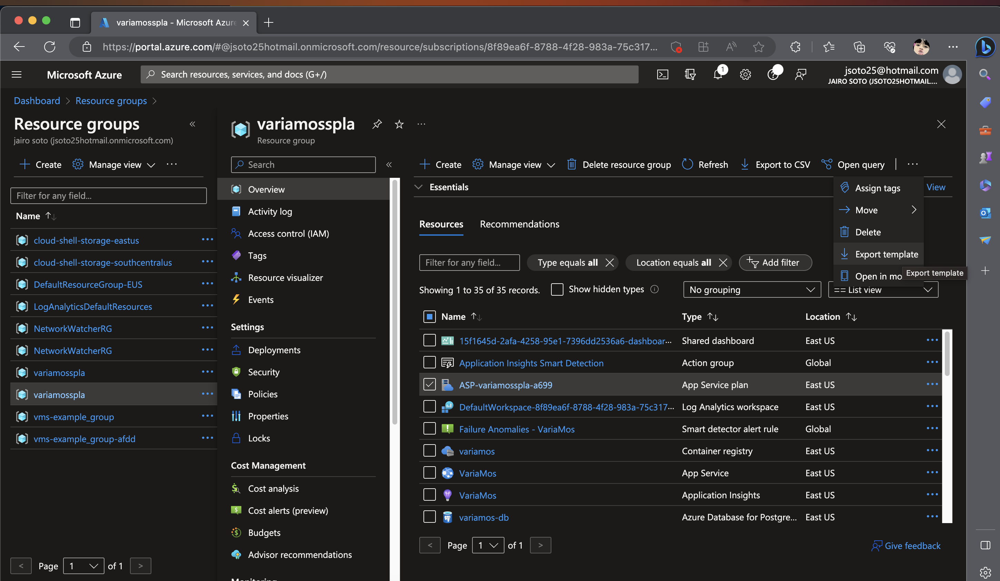
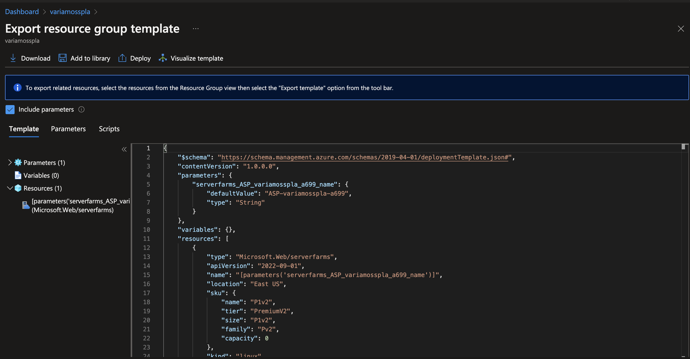
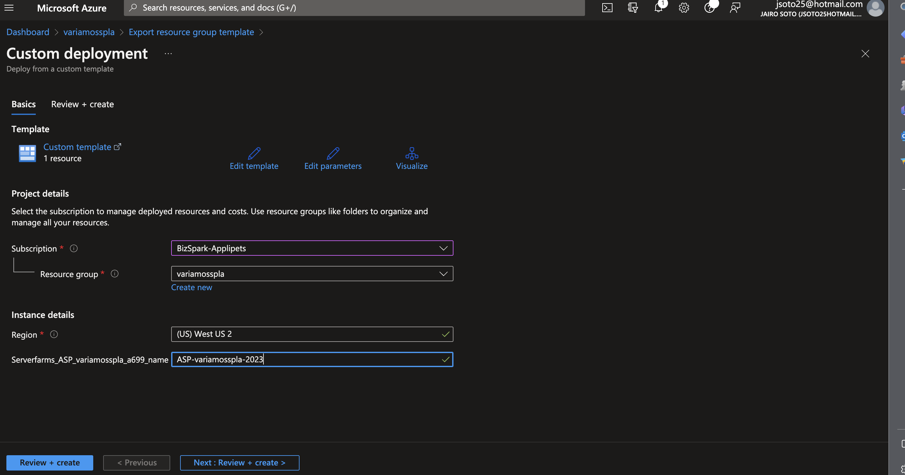
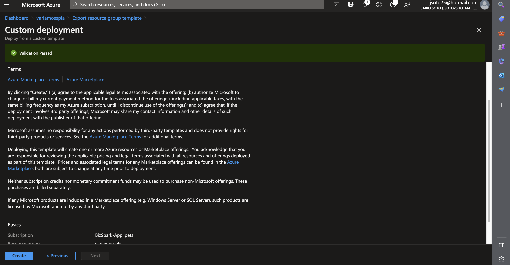
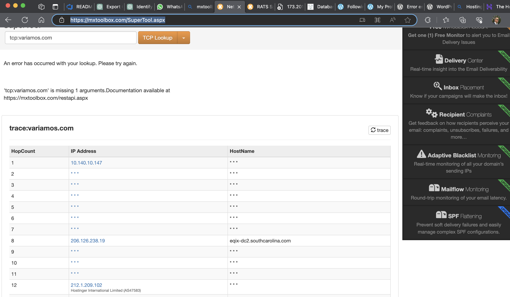

# Variamos Errors/20230621 Disabled Azure Subscription

**Description**

The Azure Subscription, with ID: ####eb4, and name: BizSpark-TotemApps-jsoto25 was disabled for an unknown reason.

## Solution 1

**Solution**

We are going to use the subscription with ID: ######15b and name: BizSpark-Applipets 

**Region** West US 2

### Steeps

#### 1. Create resource group variamosspla on region **West US 2** in the subscription: ended in **##15b**

#### 2. Deploy the resource ASP-variamosspla-a699 into the new subscription **15b**

#### 3. Deploy variamos-db, It didn't work

Parameter 'AdministratorLoginPassword' must be specified. This parameter cannot be NULL or empty. (Code: MissingRequiredParameter)

#### 4. Deploy variamosacr

#### 5. Deploy Site: VariaMos2023

[ariamos2023.json](Variamos2023.json)

#### 6. Publish variamosple to ACR

`cd VARIAMOS-WEB`

`docker build -t variamosacr.azurecr.io/variamos/variamosple:latest .`

`docker login variamosacr.azurecr.io --username variamosacr --password U2rFQIR7q1cRV8ZXIET0uhG3glnUzFcDbqDuvAw+V8+ACRCb2i0D`

`docker push variamosacr.azurecr.io/variamos/variamosple:latest`

#### 6. Deploy App variamos-ms-languages-2023

#### 7. Deploy App variamos-ms-restriction-2023

## Solution 2

**Solution**

Hiba is going to get a 150 U$D subscription for a year.

## Where is Variamos portal hosted ?

https://www.hostinger.com/, it was found with https://mxtoolbox.com/SuperTool.aspx 

# References

