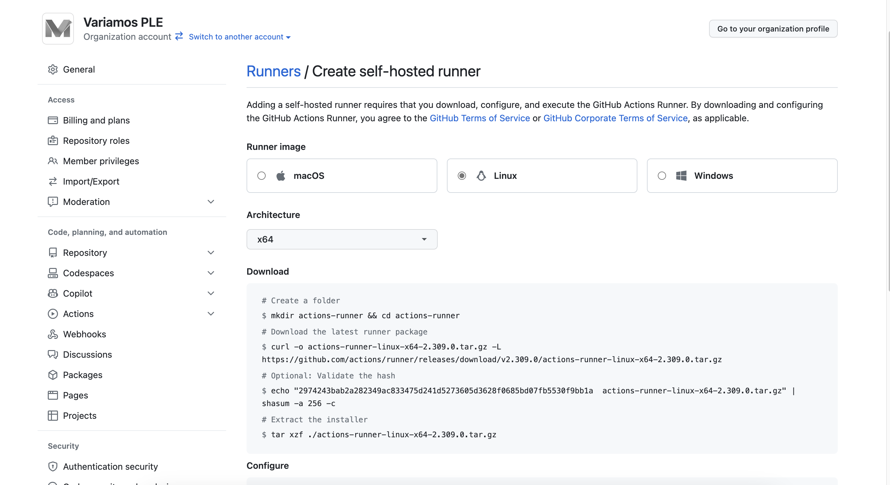
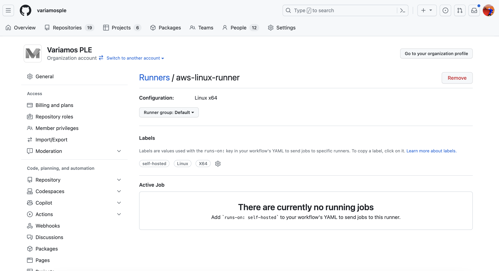
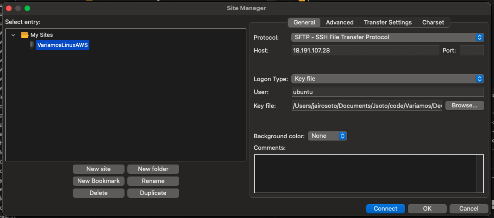

# Variamos AWS Server

## Add a self-hosted runner [1](https://docs.github.com/en/actions/hosting-your-own-runners)

### Download

**Create a folder**

$ mkdir actions-runner && cd actions-runner# Download the latest runner package

$ curl -o actions-runner-linux-x64-2.309.0.tar.gz -L https://github.com/actions/runner/releases/download/v2.309.0/actions-runner-linux-x64-2.309.0.tar.gz# Optional: Validate the hash

$ echo "2974243bab2a282349ac833475d241d5273605d3628f0685bd07fb5530f9bb1a  actions-runner-linux-x64-2.309.0.tar.gz" | shasum -a 256 -c# Extract the installer

$ tar xzf ./actions-runner-linux-x64-2.309.0.tar.gz

### Configure

**Create the runner and start the configuration experience**

$ ./config.sh --url https://github.com/variamosple --token AJ5A2HXKBBXG2P6GBV6LIW3FDYRYG# Last step, run it!

$ ./run.sh

Using your self-hosted runner

### Use this YAML in your workflow file for each job

runs-on: self-hosted

### Runner info:

**Name:** aws-linux-runner
**Work folder:** _work

**Start the Self Hosted Runner**

- Login in the AWS server

ssh -i variamos_prd.pem ubuntu@18.191.107.28

- cd to the runner directory.

cd actions-runner

- Install the runner

sudo ./svc.sh install

- Start the runner

sudo ./svc.sh start

## Copy files (docker-compose.yml) from linux to my laptop

1. Use Filezilla
2. Create a connection with the following information:

For the Key file use the .pem file.

## Up and Down docker-compose

source .env

docker-compose -f docker-compose-aws.yml up --quiet-pull

docker-compose -f docker-compose-aws.yml down

## Monitor the deployment

**View logs of a service**

docker-compose -f docker-compose-aws.yml logs dbaws

docker-compose -f docker-compose-aws.yml ps

## Ubuntu tasks

- Update all apt

sudo apt upgrade -y

- Reinicair Linux

sudo reboot

## Docker AWS Lab

docker build -t variamos_ms_languages_aws:latest -f DockerfileAws .

docker run -p 4000:4000 variamos_ms_languages_aws:latest

docker run -p 4000:4000 jasotov/variamos_ms_languages:latest

## Docker AWS Lab VariamosLnaguages

npm install

docker build -t variamoslanguages_aws:latest -f Dockerfile .

docker build -t jasotov/variamoslanguages_aws:latest -f Dockerfile .

docker build -t jasotov/variamoslanguages_aws:1.0.1 -f Dockerfile .

docker push jasotov/variamoslanguages_aws:latest

docker run -p 10000:3000 --name variamoslanguages_aws03  jasotov/variamoslanguages_aws:latest
docker run -p 4000:4000 --name variamoslanguages_aws03  jasotov/variamoslanguages_aws:latest
docker run -p 10000:4000 --name variamoslanguages_aws05  variamoslanguages_aws:latest
docker run --name variamoslanguages_aws06  variamoslanguages_aws:latest
docker run -p 10020:3000 --name variamoslanguages_aws07  variamoslanguages_aws:latest

docker run -p 10010:3000 --name variamoslanguages_aws05  jasotov/variamoslanguages_aws:1.0.1

docker-compose -f docker-compose-aws.yml up -d

**Error:** 

WARNING: The requested image's platform (linux/arm64/v8) does not match the detected host platform (linux/amd64/v4) and no specific platform was requested
exec /usr/local/bin/docker-entrypoint.sh: exec format error

**Error202231022:**

docker logs variamoslanguages_aws

docker-entrypoint.sh npm   Exit 1  

exec /usr/local/bin/docker-entrypoint.sh: exec format error

# Restore DB

Backup manual desde pgadmin en formato plain

psql -h 172.21.0.3 -p 5432 -U adminpg VariamosDB<variamosplain.sql

## Find the ip of the container

docker inspect -f '{{range .NetworkSettings.Networks}}{{.IPAddress}}{{end}}' variamos_db_aws
172.21.0.3

## Start and stop the containers

docker-compose -f docker-compose-aws.yml stop

docker-compose -f docker-compose-aws.yml start

## References
1. [Hosting your own runners](https://docs.github.com/en/actions/hosting-your-own-runners)