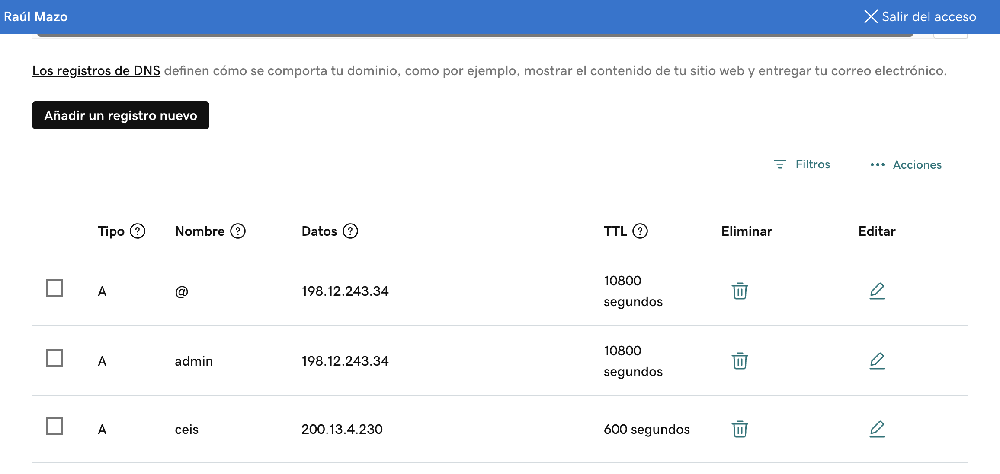

# ceis.variamos.com/SSL

## 1. Verify the SSL connection

1. Check port 443 access from a remote workstation

`nc -vz ceis.variamos.com 443`

nc: connectx to ceis.variamos.com port 443 (tcp) failed: Connection **refused**

`nc -vz 200.13.4.230 443`
 
nc: connectx to 200.13.4.230 port 443 (tcp) failed: Connection **refused**

## 2. Set up SSL on ceis.variamos.com server

1. Create a DNS Record  type A on Goddady for the variamos.com domain.

A	ceis	200.13.4.230	600 segundos		

# References

1. [SSL - ceis.variamos.com](https://chatgpt.com/share/6707afb5-9820-800a-975e-75298db883e5)

2. [MSToolBox]()https://mxtoolbox.com/